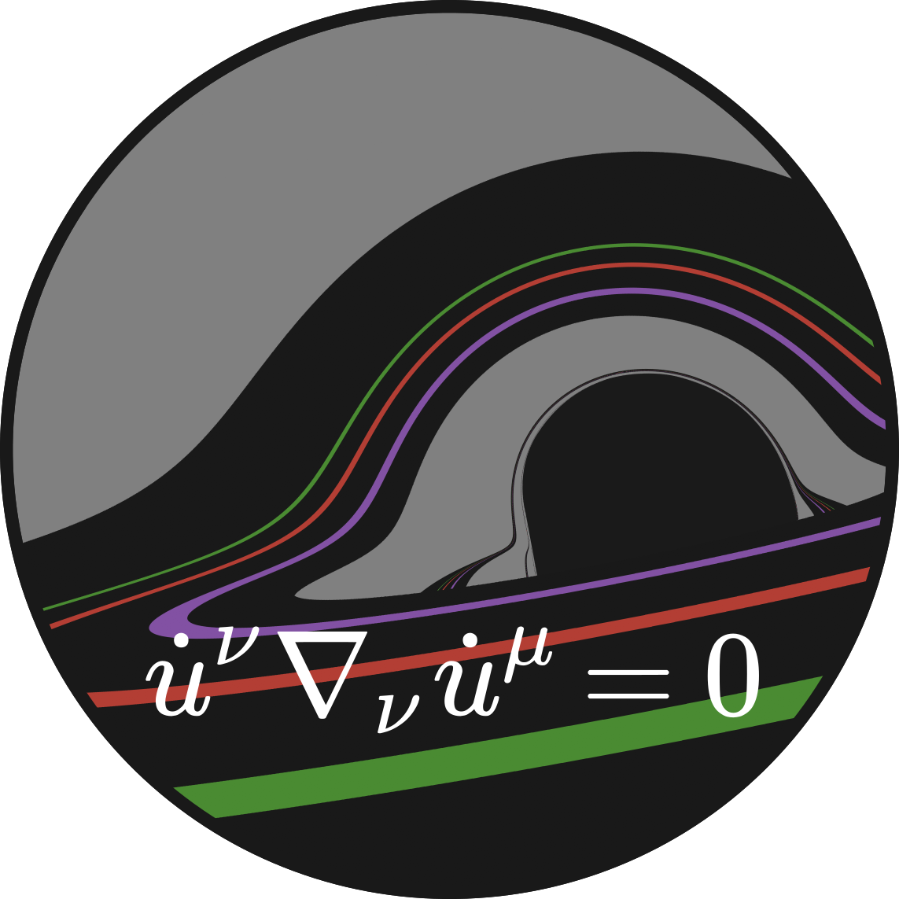

<p align="center">
  
</p>

# Gradus.jl

<a href="https://codecov.io/gh/astro-group-bristol/Gradus.jl">
    
</a>
<a href="https://github.com/astro-group-bristol/Gradus.jl/actions/workflows/test.yml">
    
</a>
<a href="https://doi.org/10.5281/zenodo.6471796">
    
</a> 
<a href="https://astro-group-bristol.github.io/Gradus.jl/dev/">

</a>


A spacetime generic, relativistic ray tracing toolkit, leveraging AD and CAS, capable of calculating reverberation lags around accreting black holes and observational signatures.

<p align="center"> <i> This package is in development. Please see the documentation.</i> </p>

## About

A pure Julia geodesic integration system built on [DifferentialEquations.jl](https://github.com/SciML/DifferentialEquations.jl) using automatic differentiation (AD) and computer algebra systems (CAS) to efficiently compute the geodesic equation. This package requires only a specification of the non-zero metric components in order to solve the 2nd order geodesic system. Alternatively, an implementation of the four velocity components may be specified to integrate a regular 1st order system.

The motivation behind this package began with an interest in studying reverberation lags around accreting black holes, however the scope has since expanded to facilitate the exploration of generic metrics through time-like, space-like, and null geodesics. 

Our aim is to make testing modified Kerr metrics and alternative gravity theories fast.

Gradus.jl allows for drastically different relativistic simulations to be computed with a composable and reusable API, permitting an end user to simply and expressively calculate physical formulae, create observational signatures, and interface with other popular astrophysics tools. Gradus.jl implements a number of high level abstractions, on the path towards a fully parallelized, high performance numerical relativity ecosystem, scalable from personal computers to super computers.

## Usage

We assume you already have Julia >1.6 installed, in which case you can just add the package from the GitHub URL:
```julia
import Pkg;
Pkg.add(url = "https://github.com/astro-group-bristol/Gradus.jl")

using Gradus
```

## See also 

This work would not be possible without the incredible work of:

- [The Julia programming language](https://github.com/JuliaLang/Julia)
- [DifferentialEquations.jl](https://github.com/SciML/DifferentialEquations.jl)
- [ForwardDiff.jl](https://github.com/JuliaDiff/ForwardDiff.jl)

<hr>

<p align="center"> Astrophysics Group Bristol </p>