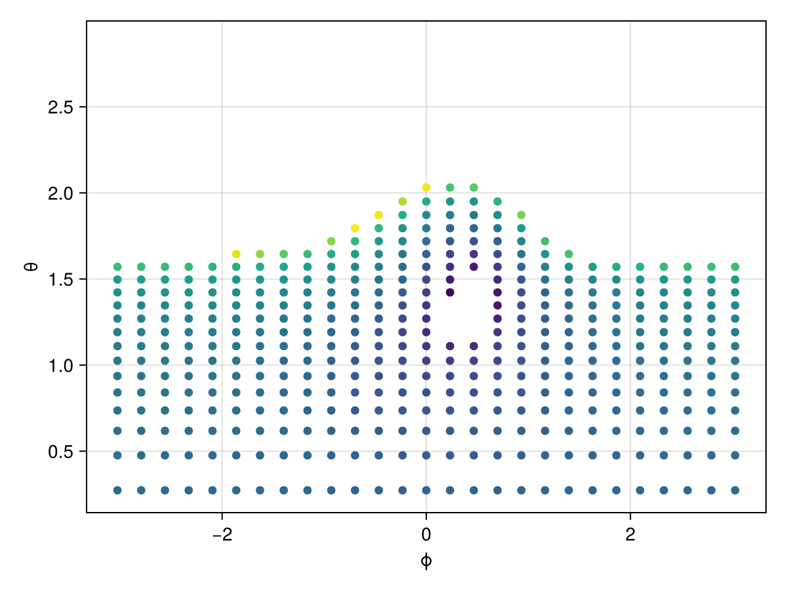
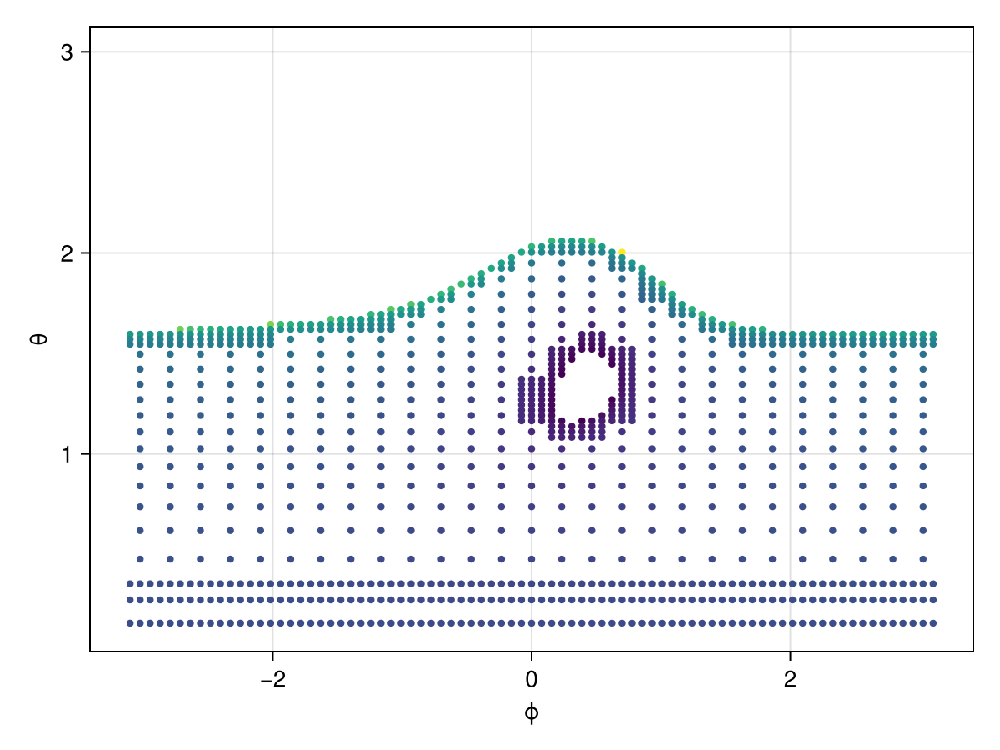
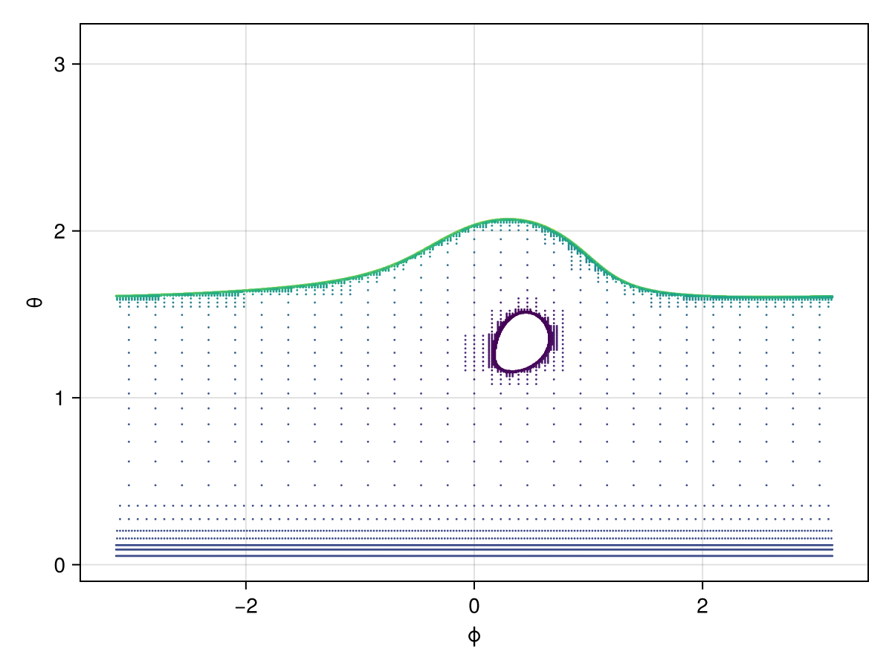
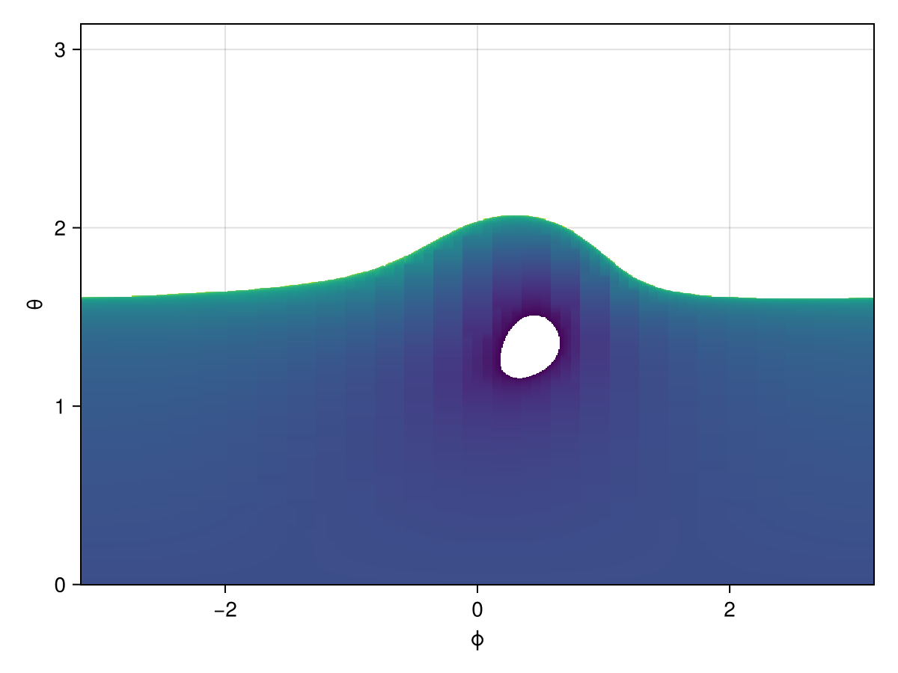
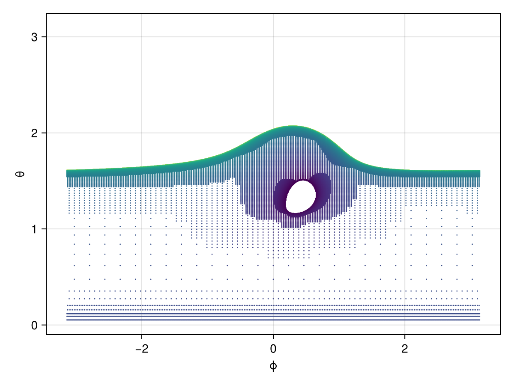
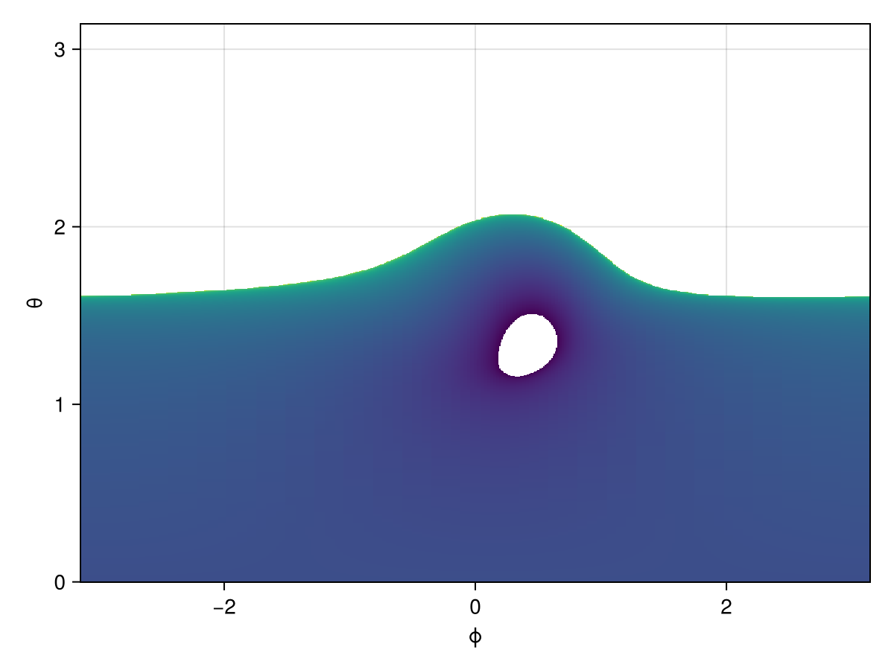

# Adaptive tracing

Gradus.jl has a variety of skies and image planes that it supports, which act as a method for representing the view of a particular observer in the system. The difference in definition that Gradus uses is that a _sky_ represents either a full sphere (or hemisphere) of possible trajectories, whereas a _image plane_ is a subset of the sphere that projects onto a two-dimensional plane. Image planes are only really used in the context of calculating observational signatures from the perspective of telescopes, whereas skies are used as intermediary representations to calculate e.g. illumination patterns or visibilities.

To integrate over a sky, each angle pair ``(\theta, \phi)`` is used to calculate a direction vector, which is transformed by the local basis into an initial velocity vector that is sensitive to the motion of the emitter. These trajectories can be heavily distorted due to relativistic beaming if the emitter is moving at relativistic speeds.

One of the main problem with integrating over a sky in any kind of numerically meaningful way is that the angles, if sampled uniformly over ``\theta \sim \mathcal{U}(0, \pi)`` and ``\phi \sim \mathcal{U}(0, 2\pi)``, then the majority of trajectories will be scrunched near the poles. To avoid this issue, one can instead sample ``\cos \theta \sim \mathcal{U}(-1, 1)``, which acts to impose the ``\sin \theta`` probability density term.

This however still has the problem that often very few regions of the sky actually represent something interesting. For example, say we were calculating the illumination pattern of the disc for an emitter close the black hole -- we do not care about those trajectories that fall into the black hole or escape to infinity, only those that hit the disc. However, a hand-wavey 50% of the sky will be either the black hole or infinity, so it is wasting precious CPU cycles calculating those trajectories when we know they are not relevant to our result.

This is where _adaptive tracing_ is useful. It traces an initial coarse grid of _pilot geodesics_ that can be used to work out where information of interest is in the sky.

To illustrate this, we'll use a pre-defined adaptive sky implementation, but at the end of these instructions will be a section on [Custom refinement criteria](@ref).

```julia
using Gradus, Makie, CairoMakie

m = KerrMetric(1.0, 0.998)
# the ring-corona can also be used to represent any off-axis point
corona = RingCorona(; r = 10.0, h = 4.0)
d = ThinDisc(0.0, Inf)

sky = AdaptiveSky(m, corona, d)
```

The [`AdaptiveSky`](@ref) uses a grid of 3x3 cells, where each cell can be
continuously refined to smaller 3x3 cells. It refers to each refinement as a `level`, where `level == 1` are the top 9 cells.

We need to prime the refined grid, so we trace three levels, corresponding to ``9^3 = 729`` trajectories.

```@docs
Gradus.trace_initial!
```

```julia
# trace an initial grid of points
trace_initial!(sky)
```

The printout may record a greater number of values than you expect. This is
because it is recording the number of values it has stored, and some cells
double up in the implementation (though they are not traced, their memory is
duplicated currently).

We can visualise the sky using one of the unpacking functions

```@docs
Gradus.unpack_sky
```

The `V` type of the sky we have constructed is [`CoronaGridValues`](@ref).

```julia
function plot_sky(sky; kwargs...)
    phi, cos_theta, values = unpack_sky(sky)
    theta = acos.(cos_theta)
    # get the radius that each geodesic hit
    Rs = [v.r for v in values]

    fig, ax, _ = scatter(phi, theta; color = log10.(Rs), kwargs...)
    ax.xlabel = "ϕ"
    ax.ylabel = "θ"
    fig
end

plot_sky(sky)
```


Not all of the points have been drawn, since those that either fell into the black hole or went to inifinity had their radius set to `NaN`. This is a feature of the particular [`AdaptiveSky`](@ref) we have used, but you can handle this however you like in your own implementation.

Lets say we are now interested in the edges of the disc, and want to refine those points. We can define a _refine_ condition that is given pairs of neighbouring points and asks whether the cells they are in need to be refined.

In our case, if one or the other is `NaN` (but not both), we want to refine those cells. We'll implement the full function, but there are utilities to help as well like [`Gradus.refine_function`](@ref).
```julia
function refine_edges(sky::AdaptiveSky, i1::Int, i2::Int)
    v1 = sky.values[i1]
    v2 = sky.values[i2]
    if isnan(v1.r) && isnan(v2.r)
        false # do not refine
    else
        isnan(v1.r) || isnan(v2.r)
    end
end

trace_step!(sky; check_refine = refine_edges, verbose = true)
```

Plotting the sky again

```julia
plot_sky(sky; markersize = 6)
```

!!! note

    There is currently a bug where the bottom row of cells are always refined
    when checking `NaN`. This will be fixed in future versions.



We can run this step a couple more times:

```julia
for i in 1:2
    trace_step!(sky; check_refine = refine_edges, verbose = true)
end

plot_sky(sky; markersize = 2)
```



Cool, now let's inpaint the rest using an interpolation scheme:

```@docs
Gradus.fill_sky_values
```

!!! warning

    The interpolation scheme used is very poor at the moment, and effectively does column-wise interpolation, without considering other surrounding neighbours. This will also be fixed in future versions.

```julia
phi, theta, grid = fill_sky_values(sky, 1080)
Rs = [v.r for v in grid]

fig, ax, _ = heatmap(phi, theta, log10.(Rs)')
ax.xlabel = "ϕ"
ax.ylabel = "θ"
fig
```



What if we had a refinemenet criteria based on the relative values of neighbours?

```julia
function refine_distant(sky::AdaptiveSky, i1::Int, i2::Int)
    v1 = sky.values[i1]
    v2 = sky.values[i2]
    if isnan(v1.r) && isnan(v2.r)
        false # do not refine
    else
        # refine if they are more than 10% different
        !isapprox(v1.r, v2.r, rtol = 0.1)
    end
end

# create a fresh sky
sky = AdaptiveSky(m, corona, d)
trace_initial!(sky)
for i in 1:3
    trace_step!(sky; check_refine = refine_distant, verbose = true)
end

plot_sky(sky; markersize = 2)
```



Now our inpainting should look more convincing

```julia
phi, theta, grid = fill_sky_values(sky, 1080)
Rs = [v.r for v in grid]

fig, ax, _ = heatmap(phi, theta, log10.(Rs)')
ax.xlabel = "ϕ"
ax.ylabel = "θ"
fig
```



## Custom adaptive refinement

```@docs
Gradus.AdaptiveSky
Gradus.trace_step!
Gradus.refine_function
Gradus.fine_refine_function
Gradus.Grids.AdaptiveCell
Gradus.Grids.AdaptiveGrid
```