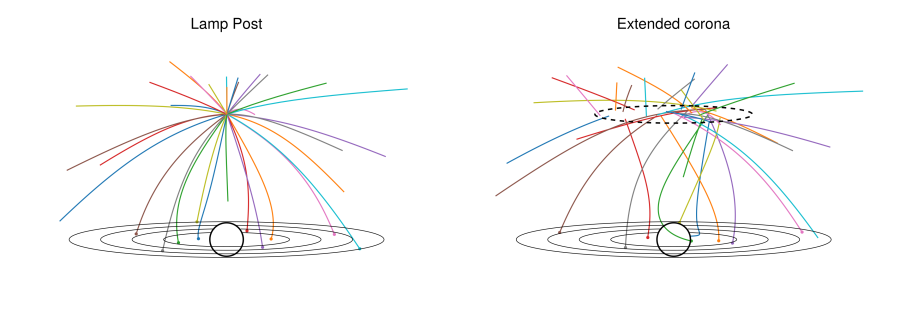

# Disc emissivity

```@meta
CurrentModule = Gradus
```

The emissivity of an accretion disc is the intensity of radiation coming from a given patch of the disc. In addition to the inherent thermal flux in the disc, GRRTs can be used to estimate reflected flux from a coronal source.

```@docs
source_to_disc_emissivity
```

These functions are not meant to be directly interacted with. Instead, Gradus abstracts these definitions into profile structs. These structs bin the emissivity in various ways -- for example [`RadialDiscProfile`](@ref).

## Calculating emissivity profiles

Depending on the geometry of the corona, the symmetries of the spacetime, and the type of disc being traced, there are sometimes very efficient schemes for calculating the emissivity profiles.

As a motivating example, consider the lamp post geometry with 64 rays. These may either be traced by sampling directions on the local sky of the emitter:


Or, alternatively, we may exploit the radial symmetry of the system, and sample fewer points in the two dimensional ``x``-``z`` plane:


!!! note
    For detailed descriptions of these methods, see [Emissivity profile algorithms](@ref).

Both of these methods can be used to estimate the emissivity profiles with trivial changes to switch between them

```@docs
emissivity_profile
```

## Using emissivity profiles

## Adding coronal models

A coronal model must minimally specify how pairs of source position and velocity are to be sampled. For example, the lamp post model has only a single position (the point location), and is stationary. A stationary extended corona has different positions, but always the same velocity, and a moving extended source has both a position and velocity distribution which must be sampled to calculate the emissivity profile:



Coronal sources must subtype [`AbstractCoronaModel`](@ref):

```@docs
AbstractCoronaModel
sample_position_velocity
```

## Radial disc profile

```@docs
RadialDiscProfile
```

## Emissivity profile algorithms

In this case, we must be careful to weight the emissivity accordingly:

```@docs
point_source_equitorial_disc_emissivity
```
