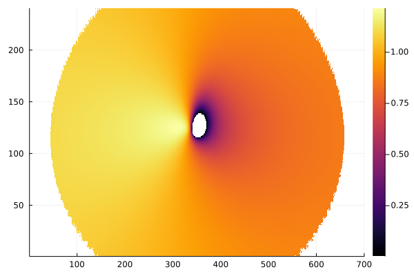
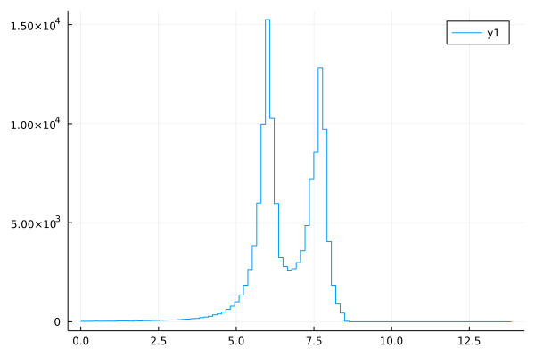
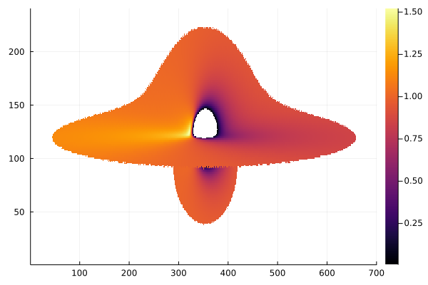

# Examples

## Redshift image

!!! note
    The [`Gradus.ConstPointFunctions.redshift`](@ref) function is an analytic solution for redshift, which may not be implemented for every type of metric or disc geometry. See [Interpolating redshifts](@ref) for a more flexible numeric alternative.

```julia
using Gradus
using StaticArrays
using Plots

# metric and metric parameters
m = BoyerLindquistAD(M=1.0, a=1.0)
# observer position
u = @SVector [0.0, 1000.0, deg2rad(60), 0.0]
# accretion disc
d = GeometricThinDisc(1.0, 50.0, deg2rad(90))

# define point function which filters geodesics that intersected the accretion disc
# and use those to calculate redshift
pf = Gradus.ConstPointFunctions.redshift ∘ Gradus.ConstPointFunctions.filter_intersected

img = rendergeodesics(
    m,
    u,
    d,
    # maximum integration time
    2000.0,
    fov_factor = 6.0,
    image_width = 700,
    image_height = 240,
    verbose = true,
    pf = pf
)

heatmap(img)
```



## Line profile

Using the redshift example, we can bin a line-profile using [StatsBase.jl](https://juliastats.org/StatsBase.jl/stable/empirical/#StatsBase.Histogram). We'll calculate the iron line profile, with a delta-emission at 6.4 keV.

```julia
using StatsBase

# remove nans and flatten the redshift image
redshift_data = filter(!isnan, vec(img))

# transpose to iron-line
data = redshift_data .* 6.4

x_bins = range(0.0, 10.0, 100) 
lineprof = fit(Histogram, data, x_bins)

plot(x_bins[1:end-1], lineprof.weights, seriestype = :steppre)
```



## Interpolating redshifts

In cases where no analytic redshift solution is known, we can instead interpolate a numeric approximation. For example, interpolating the plunging region velocities and using the analytic solution for general static, axis symmetric metrics outside of the ISCO can be achieved with:

```julia
using Gradus
using StaticArrays
using Plots

# metric and metric parameters
m = BoyerLindquistAD(M=1.0, a=0.4)
# observer's initial position
u = @SVector [0.0, 1000.0, deg2rad(85), 0.0]
# accretion disc
d = GeometricThinDisc(1.0, 50.0, deg2rad(90))

pl_int = interpolate_plunging_velocities(m)

redshift = interpolate_redshift(pl_int, u)

pf = redshift ∘ Gradus.ConstPointFunctions.filter_intersected

img = rendergeodesics(
    m,
    u,
    d,
    # maximum integration time
    2000.0,
    fov_factor = 6.0,
    image_width = 700,
    image_height = 240,
    verbose = true,
    pf = pf
)

heatmap(img)
```



For more complex disc geometry: TODO