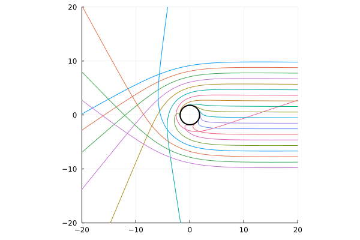
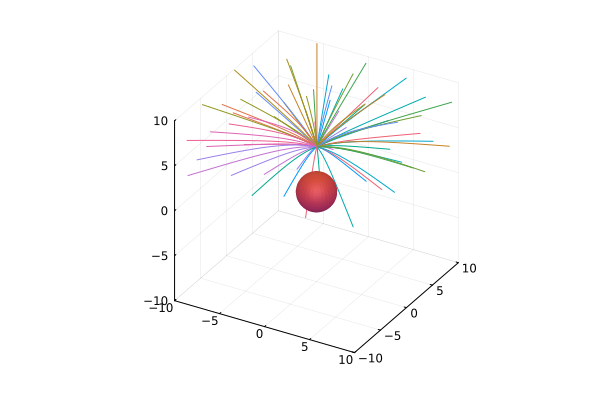
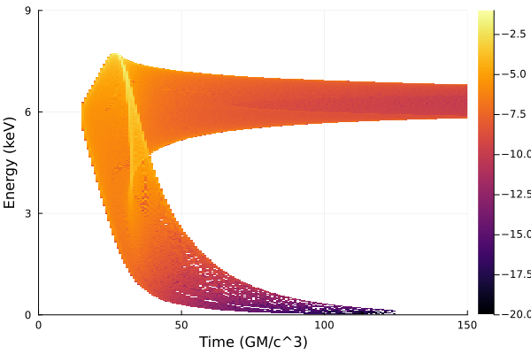
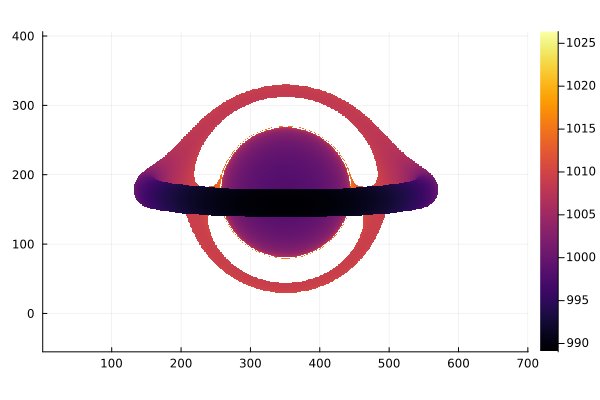
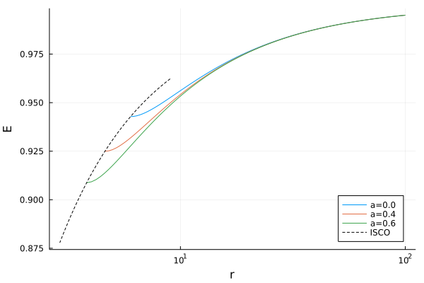
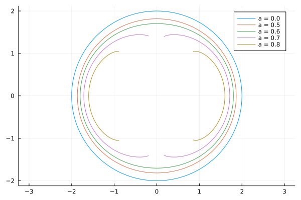
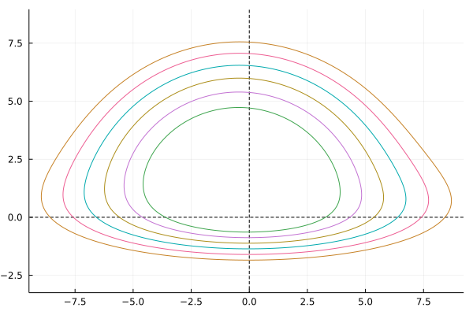

# Examples

```@contents
Pages = ["examples.md"]
Depth = 3
```

## Tracing geodesic paths

```julia
using Gradus
using Plots

m = JohannsenPsaltisMetric(M=1.0, a=0.6, ϵ3=2.0)
# observer position
u = @SVector [0.0, 1000.0, π/2, 0.0]

# set up impact parameter space
α = collect(range(-10.0, 10.0, 20))
β = [0.0 for _ in α]

# build initial velocity and position vectors
vs = map_impact_parameters(m, u, α, β)
us = [u for _ in vs]

sols = tracegeodesics(
    m, us, vs, (0.0, 2000.0);
    abstol = 1e-12, reltol = 1e-12
)

plot_paths(sols, legend = false, n_points = 2048)
plot_horizon!(m, lw = 2.0, color = :black)
```



Alternatively, plotting the 3D paths from e.g. a lamp-post coronal model:

```julia
m = KerrMetric(a = 0.0)

model = LampPostModel()
sols = tracegeodesics(
    m,
    model,
    2000.0,
    n_samples = 64
)

plot_paths_3d(sols, legend=false, extent = 10, t_span = 100.0)
plot_horizon_3d!(m)
```



## Shadow

```julia
using Gradus
using Plots

m = KerrMetric(1.0, 0.998)
u = SVector(0.0, 1000.0, π / 2, 0.0)

α, β, img = rendergeodesics(
    m,
    u,
    # max integration time
    2000.0,
    image_width = 1000,
    image_height = 1000,
    fov = 70.0,
    verbose = true,
    # geodesics can get much closer to the event horizon than 
    # normal
    closest_approach = 1.001,
    ensemble = Gradus.EnsembleEndpointThreads(),
)

p = heatmap(
    α,
    β,
    img,
    color = :grayC,
    xlabel = "α",
    ylabel = "β",
    aspect_ratio = 1,
    minorgrid = true,
)
contour!(p, α, β, img, color = :red)
```


## Redshift image

!!! note
    The [`Gradus.ConstPointFunctions.redshift`](@ref) function is an analytic solution for redshift, which may not be implemented for every type of metric or disc geometry. See [Interpolating redshifts](@ref) for a more flexible numeric alternative.

```julia
using Gradus
using StaticArrays
using Plots

# metric and metric parameters
m = KerrMetric(M=1.0, a=1.0)
# observer position
u = @SVector [0.0, 1000.0, deg2rad(60), 0.0]
# accretion disc
d = GeometricThinDisc(1.0, 50.0, deg2rad(90))

# define point function which filters geodesics that intersected the accretion disc
# and use those to calculate redshift
pf = ConstPointFunctions.redshift(m, u) ∘ ConstPointFunctions.filter_intersected

α, β, img = rendergeodesics(
    m,
    u,
    d,
    # maximum integration time
    2000.0,
    fov = 6.0,
    image_width = 700,
    image_height = 240,
    verbose = true,
    pf = pf
)

heatmap(α, β, img)
```


## Redshift line-profile 

Using the redshift example, we can bin a redshift line-profile using [StatsBase.jl](https://juliastats.org/StatsBase.jl/stable/empirical/#StatsBase.Histogram). We'll calculate the iron line redshift profile, with a delta-emission at 6.4 keV.

```julia
using StatsBase

# remove nans and flatten the redshift image
redshift_data = filter(!isnan, vec(img))

# transpose to iron-line
data = redshift_data .* 6.4

x_bins = range(0.0, 10.0, 100) 
lineprof = fit(Histogram, data, x_bins)

plot(x_bins[1:end-1], lineprof.weights, seriestype = :steppre)
```


## Line profiles

Line profiles may be calculated using two different methods -- using image-plane binning and integrating Cunningham transfer functions -- both of which are implemented in Gradus.jl. By default, the Cunningham transfer function method is used, however passing either `BinnedLineProfile()` or `CunninghamLineProfile()` as the first argument to `lineprofile` allows for explicit specification of the algorithm.

For a simple maximally-spinning Kerr black hole, the iron line profile (with a delta emission line at 6.4 keV) may be calculated with:

```julia
d = GeometricThinDisc(0.0, 400.0, π / 2)
u = @SVector [0.0, 1000.0, deg2rad(40), 0.0]
m = KerrMetric(1.0, 0.998)

# maximal integration radius
maxrₑ = 50.0

# emissivity function
ε(r) = r^(-3)

# g grid to do flux integration over
gs = range(0.0, 1.2, 500)
_, flux = lineprofile(gs, ε, m, u, d, maxrₑ = maxrₑ)

# transform to observed energy
energy = gs .* 6.4

# plot flux as a function of energy
plot(energy, flux, legend=false)
```


## Reverberation transfer functions

```julia
m = KerrMetric(1.0, 0.998)
u = SVector(0.0, 1000.0, deg2rad(60), 0.0)
d = GeometricThinDisc(0.0, 1000.0, π / 2)

# specify coronal geometry
model = LampPostModel(h = 10.0)
# gridding for the photon plane
plane = PolarPlane(GeometricGrid(); Nr = 1800, Nθ = 1800)

# integrate source to disc and observer to disc
tf = @time lagtransfer(
    model,
    m,
    u,
    plane,
    d,
    callback = domain_upper_hemisphere(),
    n_samples = 100_000,
    verbose = true,
)

# bin into a 2d grid, returning the time and energy axis, 
# and the flux in each bin
t, E, f = binflux(tf, N_E = 1500, N_t = 1500)

# take the log for visualisation purposes
I = f .> 0
f[I] .= log.(f[I])

p = heatmap(
    t,
    E,
    f,
    xlabel = "Time (GM/c^3)",
    ylabel = "Energy (keV)",
    xrange = [0, 150],
    yrange = [0, 9],
    clims = (-20, -1),
)
```



## Covariant radiative transfer

```julia
# metric and metric parameters
m = KerrMetric(M = 1.0, a = 1.0)
# observer position
u = SVector(0.0, 1000.0, deg2rad(80), 0.0)
# accretion disc
d = PolishDoughnut(m)

# define point function which reads the auxiliary variable
# which is contextually the intensity
pf = PointFunction((m, gp, t) -> gp.aux[1])

a, b, img = @time rendergeodesics(
    m,
    u,
    d,
    # maximum integration time
    2000.0,
    fov = 10.0,
    image_width = 600,
    image_height = 500,
    verbose = true,
    pf = pf,
    trace = Gradus.TraceRadiativeTransfer(),
)

heatmap(a, b, img, aspect_ratio = 1, xlabel = "α", ylabel = "β")
```


## Interpolating redshifts

In cases where no analytic redshift solution is known, we can instead interpolate a numeric approximation. For example, interpolating the plunging region velocities and using the analytic solution for general static, axis symmetric metrics outside of the ISCO can be achieved with:

```julia
using Gradus
using StaticArrays
using Plots

# metric and metric parameters
m = KerrMetric(M=1.0, a=0.4)
# observer's initial position
u = @SVector [0.0, 1000.0, deg2rad(85), 0.0]
# accretion disc
d = GeometricThinDisc(1.0, 50.0, deg2rad(90))

pl_int = interpolate_plunging_velocities(m)

redshift = interpolate_redshift(pl_int, u)

pf = redshift ∘ ConstPointFunctions.filter_intersected

α, β, img = rendergeodesics(
    m,
    u,
    d,
    # maximum integration time
    2000.0,
    fov = 6.0,
    image_width = 700,
    image_height = 240,
    verbose = true,
    pf = pf
)

heatmap(α, β, img)
```


## Disc geometries

Gradus makes it easy to define new height cross sections for thick discs:

```julia
using Gradus
using StaticArrays
using Plots

m = KerrMetric(1.0, 0.0)
u = @SVector [0.0, 1000.0, deg2rad(85), 0.0]

# define the disc shape -- return a negative number 
# where the disc should not be intersected, else the cross 
# sectional height
d = ThickDisc() do u
    r = u[2]
    if r < 9.0 || r > 11.0
        return -1.0
    else
        x = r - 10.0
        sqrt(1 - x^2)
    end
end

# and then render as usual
α, β, img = rendergeodesics(
    m,
    u,
    d,
    2000.0,
    fov = 18.0,
    image_width = 700,
    image_height = 350,
    verbose = true,
    pf = pf
)

heatmap(α, β, img, aspect_ratio=1)
```



For more disc on disc geometry, see [`AbstractAccretionDisc`](@ref) and associated sections.

## Circular orbits

Simple equatorial circular orbits are straight forward to calculate with Gradus.jl:

```julia
using Gradus
using Plots
using StaticArrays

m = KerrMetric(M=1.0, a=0.8)

p = plot(aspect_ratio=1)

for r in [3.0, 4.0, 5.0, 6.0]
    v = CircularOrbits.fourvelocity(m, r)
    # trace the circular orbit
    path = tracegeodesics(m, @SVector([0.0, r, π/2, 0.0]), v, (0.0, 300.0), μ = 1.0)
    r = [path(t)[2] for t in range(0.0, 100, 200)]
    ϕ = [path(t)[4] for t in range(0.0, 100, 200)]

    x = @. r * cos(ϕ)
    y = @. r * sin(ϕ)

    plot!(p, x, y, label = false)
end

p
```


## ISCO

The [Gradus.isco](@ref) may be calculated with a simple convenience function, as may the energy associated with a given stable circular orbit.

```julia
using Gradus
using Plots

# prepare plot
p = plot(legend=:bottomright, ylabel = "E", xlabel = "r", xscale = :log10)

# choice of spin to plot energy curves for
for a in [0.0, 0.4, 0.6]
    m = KerrMetric(M = 1.0, a = a)

    rs = range(Gradus.isco(m), 100.0, 500)
    energy = map(rs) do r
        CircularOrbits.energy(m, r)
    end

    plot!(rs, energy, label = "a=$a")
end

# calculate the ISCO as a function of spin
data = map(range(-1.0, 0.8, 100)) do a
    m = KerrMetric(M = 1.0, a = a)
    r = Gradus.isco(m)
    CircularOrbits.energy(m, r), r
end

# overlay onto plot
plot!(last.(data), first.(data), color=:black, linestyle=:dash, label="ISCO")
```



## Event horizons and naked singularities

Here is an example of how to use [`event_horizon`](@ref) to plot the shape of an event horizon in two dimensions. In the case of a naked singularity, as with the certain parameters combinations in the [`JohannsenPsaltisMetric`](@ref) metric, we see a disconnected region in the plot.

```julia
using Gradus
using Plots

function draw_horizon(p, m)
    rs, θs = event_horizon(m, resolution = 200)
    radius = rs

    x = @. radius * cos(θs)
    y = @. radius * sin(θs)
    plot!(p, x, y, label = "a = $(m.a)")
end

p = plot(aspect_ratio = 1)
for a in [0.0, 0.5, 0.6, 0.7, 0.8]
    m = JohannsenPsaltisMetric(M = 1.0, a = a, ϵ3 = 2.0)
    draw_horizon(p, m)
end
p
```



We can also calculate parameter combinations that lead to naked singularities, and plot the parameter space domains to show exclusion zones:

```julia
function calc_exclusion(as, ϵs)
    regions = [
        is_naked_singularity(JohannsenPsaltisMetric(M = 1.0, a = a, ϵ3 = ϵ))
        for a in as, ϵ in ϵs
    ]

    map(i -> i ? 1.0 : NaN, regions)
end

# define ranges (small in this example as a little computationally intense)
as = range(0, 1.0, 40)
ϵs = range(-10, 10, 40)

img = calc_exclusion(as, ϵs)
heatmap(
    as, 
    ϵs, 
    img', 
    color = :black, 
    colorbar = false, 
    xlabel = "a", 
    ylabel = "ϵ"
)
```


## Cunningham transfer functions

Recreating Fig. 1 and 2 from [Bambi et al. (2017)](https://iopscience.iop.org/article/10.3847/1538-4357/aa74c0) for the transfer functions of a Kerr black hole

```julia
using Gradus
using StaticArrays
using Plots

m = KerrMetric(M=1.0, a=0.998)
d = GeometricThinDisc(0.0, 100.0, π/2)

p = plot(legend = false)
for angle in [3, 35, 50, 65, 74, 85]
    u = @SVector [0.0, 1000.0, deg2rad(angle), 0.0]
    ctf = cunningham_transfer_function(
        m, u, d, 4.0
    )
    mask = @. (ctf.g✶ > 0.001) & (ctf.g✶ < 0.999)
    @views plot!(p, ctf.g✶[mask], ctf.f[mask])
end
p
```


And Fig. 2:

```julia
# new position vector
u = @SVector [0.0, 1000.0, deg2rad(30), 0.0]

p = plot(legend = false)
for a in [0.0, 0.25, 0.5, 0.75, 0.9, 0.998]
    m = KerrMetric(1.0, a)
    ctf = cunningham_transfer_function(
        m, u, d, 7.0
    )
    mask = @. (ctf.g✶ > 0.001) & (ctf.g✶ < 0.999)
    @views plot!(p, ctf.g✶[mask], ctf.f[mask])
end
p
```


## Concentric rings

Recreating Figure 2 from Johannsen and Psaltis (2012, II):

```julia
using Gradus
using StaticArrays
using Plots

# their papers has a=-a
m = KerrMetric(M=1.0, a=-0.4)
u = @SVector [0.0, 1000, acos(0.25), 0.0]
d = GeometricThinDisc(0.0, 100.0, π / 2)

radii = 2.6:1.0:7.6

p = plot(
    aspect_ratio = 1,
    legend = false,
)

# crosshair on origin
hline!(p, [0.0], color = :black, linestyle=:dash)
vline!(p, [0.0], color = :black, linestyle=:dash)

for r in radii
    α, β = impact_parameters_for_radius(m, u, d, r, N=100)
    plot!(p, α, β)
end
p
```


