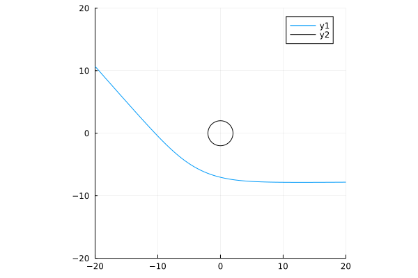
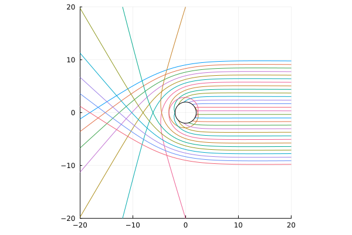
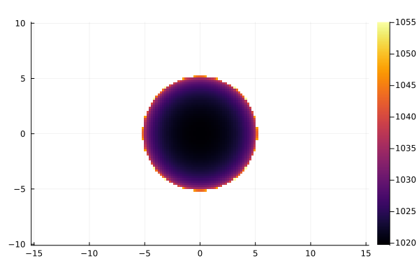
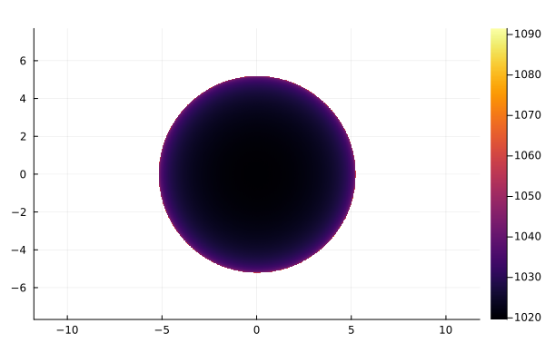
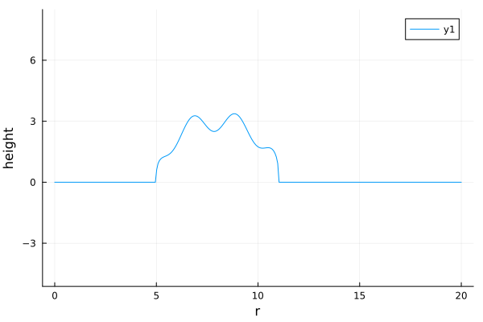
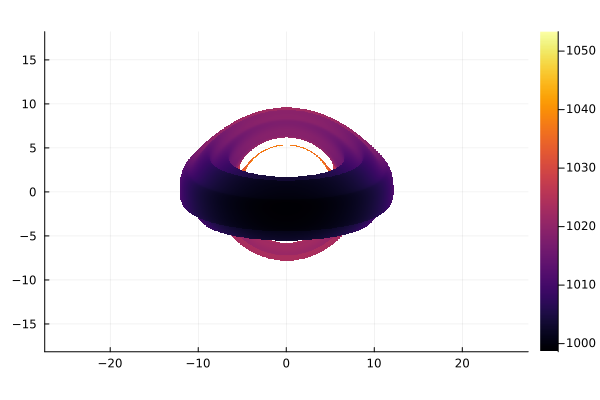
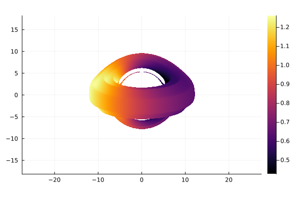
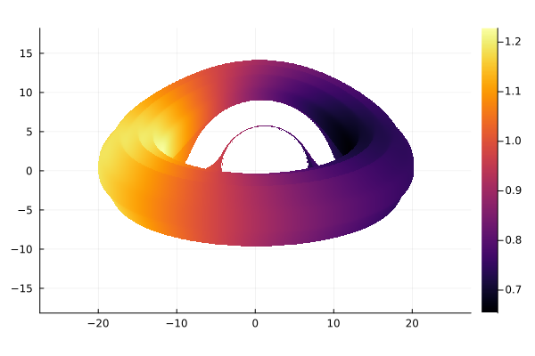
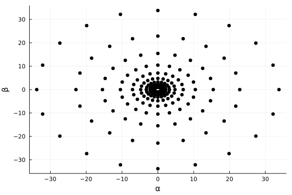
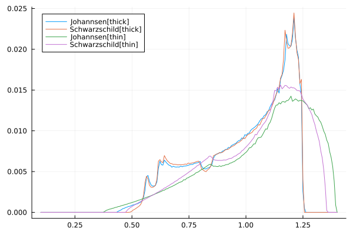

## Getting started

```@meta
CurrentModule = Gradus
```

Unlike conventional [ray-tracing](https://en.wikipedia.org/wiki/Ray_tracing_(graphics)), ray-tracing in general relativity (GR) has the added complication that the trajectory of light is altered by the curvature of space. In particular, the spacetime around compact singularities, such as black holes, may be significantly curved in weird and wonderful ways, depending on the nature of the object being studied. When attempting to visualise or calculate observational signatures related to these objects, is important to account for so-called _GR effects_; these effects not only alter how things _look_, but also the _energetics_ of the system itself.

This short getting-started guide should hopefully illustrate some of the key ideas that need to be kept in mind when studying accretion processes and simulating spectra of black holes.

## Defining a spacetime

```@docs
geodesic_equation
```

All the heavy lifting in Gradus.jl is done by [`tracegeodesics`](@ref). Minimally, we must choose a spacetime to trace in, and some initial position and velocity for our test photon. 

Let's pick the [Schwarzschild spacetime](https://en.wikipedia.org/wiki/Schwarzschild_metric), which describes a spherically symmetric black hole with mass $M$. Many metrics have already been implemented in Gradus.jl (see [Available metrics](@ref)), but for illustration, we'll implement the metric ourselves:

```julia
using Gradus

struct Schwarzschild{T} <: AbstractStaticAxisSymmetricParameters{T}
    M::T
end

function Gradus.metric_components(m::Schwarzschild, x)
    r, θ = x
    M = m.M

    dt2 = -(1 - (2M / r))
    dr2 = -inv(dt2)
    dθ2 = r^2
    dϕ2 = r^2 * sin(θ)^2
    dtdϕ = zero(r)

    SVector(dt2, dr2, dθ2, dϕ2, dtdϕ)
end

Gradus.inner_radius(m::Schwarzschild) = 2 * m.M
```

Going through this line by line:

```julia
struct Schwarzschild{T} <: AbstractStaticAxisSymmetricParameters{T}
    M::T
end
```

- First we define a `struct` that will hold the quantities parameterizing our spacetime. In this case, just the mass $M$. We declare our struct to be a _subtype_ of `AbstractStaticAxisSymmetricParameters` since we know our metric will be static (no time dependence) and axis-symmetric (no $\phi$ dependence). This describes the more general [Petrov type D](https://en.wikipedia.org/wiki/Petrov_classification) class of spacetimes, and allows Gradus.jl to make a number of simplifying assumptions under the hood about how this spacetime will behave. The `T` parameter is the number type of this metric, and dictates the precision of all numerics in the trace. Therefore, if `M` is a `Float32`, Gradus.jl will raise errors if you attempt 64-bit floating point operations when tracing. This is _by design_, since many GPU architectures prefer `Float32` for speed, especially when precision is less important, and throwing errors is preferable to debugging type coercions. 

```julia
function Gradus.metric_components(m::Schwarzschild, x)
    r, θ = x
    M = m.M

    dt2 = -(1 - (2M / r))
    dr2 = -inv(dt2)
    dθ2 = r^2
    dϕ2 = r^2 * sin(θ)^2
    dtdϕ = zero(r)

    SVector(dt2, dr2, dθ2, dϕ2, dtdϕ)
end
```

- Here we have given the actual implementation of our metric. Since the metric is static, axis-symmetric, the position vector `x` only contains the radial and poloidal coordinates, and expects the `metric_components` function to return the five matrix elements of the metric. For the Schwarzschild metric, the $\text{d}t \text{d}\phi$ component is zero everywhere, so we set this to `zero(r)`, which returns 0 but of the same type as `r`.

```julia
GradusBase.inner_radius(m::KerrMetric) = 2 * m.M
```

- Finally, we specify some inner radius for the integration. This is the cutoff around the origin at which radius the geodesic integration will stop to avoid numerical errors. Gradus.jl can also calculate the outer horizon of the metric automatically, which can be useful if you don't know the solution ahead of time, or if the solution is non-symmetric in $\theta$, but is generally slower than providing a simple prescription.

!!! note
    For a full description of implementing a metric, see [Implementing a new metric](@ref).

If you're familiar with other GRRT softwares, you might be wondering "where do we define the Christoffel symbols?", or "do I not need a prescription for Carter's constant?". Thanks to [automatic differentiation (AD)](https://en.wikipedia.org/wiki/Automatic_differentiation), we can calculate the Christoffel symbols _on the fly_! We determine the metric Jacobian with respect to coordinates of interest, and then sparsely compute the Christoffel symbols for the given spacetime class. For full details, see [Geodesic integration strategies](@ref).

## Photon trajectories

We need to instantiate the metric, and provide a position and velocity four-vector in order to trace a geodesic path. 

```@docs
constrain
```

We'll position ourselves at a great distance from the singularity at the origin, around $1000 \, r_\text{g}$ away. We'll furthermore setup our spacetime with an arbitrary choice of mass `M = 1.0`, which acts to rescale our system (since all units in Gradus.jl are in standard GR units).

The initial velocity vector we'll somewhat arbitrary set to point towards the black hole, with a small $v^\phi$ component so it is slightly offset.

The trajectory is then calculated with a call to [`tracegeodesics`](@ref):

```julia
m = Schwarzschild(1.0)
x = SVector(0.0, 1000.0, π/2, 0.0)
v = SVector(0.0, -1.0, 0.0, -8e-6)

# maximum affine time ~ 2 * x[2]
λ_max = 2000.0
sol = tracegeodesics(m, x, v, λ_max)
```

The trajectory can be plotted with the use of [Plots.jl](https://docs.juliaplots.org/latest/):

```julia
using Plots

# plot solution trajectory
plot_paths(sol)
# plot 
plot_horizon!(m)
```



To the initial velocity a little bit more interpretable, we use so-called _impact parameters_ $(\alpha, \beta)$. These may be thought of as follows: if the geodesic were a straight line path, the impact parameter in a given dimension is the distance to the origin from the closest point along the geodesic in $r_\text{g}$.

If you imagine a two dimensional image plane, where $x$ is the horizontal and $y$ the vertical coordinate, the $\alpha$ impact parameter corresponds to that closest approach along the $x$ axis, and vice versa for $\beta$.

With this, we can more easily setup a handful of geodesics to trace:

```julia
# grid of impact parameters in horizontal direction
# keeping β fixed at 0
α = range(-10.0, 10.0, 30)
vs = map_impact_parameters(m, x, α, 0.0)

# need a position for each velocity vector
xs = fill(x, size(vs))

sols = tracegeodesics(m, xs, vs, 2000.0)

# plot
p = plot_paths(sols, legend=false)
plot_horizon!(m, color = :black)
```



When we invoke [`tracegeodesics`](@ref) in this way, Gradus.jl will automatically distribute the workload onto as many threads as Julia was started with. For example, starting julia with

```bash
julia -t6
```

will spawn 6 worker threads for Gradus.jl to use. Passing `-tauto` will allow Julia to use as many threads as your hardware supports.

## Rendering an image

A common task we'll want to do is render an image; that is, assign some $(\alpha, \beta)$ to each pixel in a 2-dimensional plane at the position `x`, and trace along it, colouring the pixel according to some function of where the geodesic ends up.

The simplest thing we can do is colour the pixel by the time component of the final position. Since we don't care about what happens to the geodesic inbetween the path, we'll pass `save_on = false` to [`tracegeodesics`](@ref) to avoid the overhead of allocating a whole load of memory we don't want to use.

```julia
# set up our image parameters
α = range(-10.0, 10.0, 100)
β = range(-10.0, 10.0, 100)

# this will set up a 100x100 matrix of velocity vectors
# so we use `vec` to flatten the structure
vs = vec([map_impact_parameters(m, x, a, b) for a in α, b in β])
xs = fill(x, size(vs))

# trace in parallel
sols = tracegeodesics(m, xs, vs, 2000.0, save_on = false)
```

To help us process the solutions, Gradus.jl exports [`process_solution`](@ref), which returns a [`GeodesicPoint`](@ref) per solution. The struct contains everything we might want to know about the start and endpoint of a geodesic solution, including the four-velocity, and the nature of the termination (fell into the black hole, went to infinity, collided with some geometry, etc.). 

Let's filter those that fell into the black hole, and extract their final coordinate times $x^t |_\text{final}$:

```julia
points = process_solution.(sols.u)
# reshape into the same dimensions as the image
points = reshape(points, (100, 100))

times = map(points) do gp
    # check if went off the integration chart on the inner boundary
    if gp.status == StatusCodes.WithinInnerBoundary
        # get the time coordinate
        gp.x[1]
    else
        NaN
    end
end

heatmap(α, β, times, aspect_ratio = 1)
```



This is the so-called _shadow_ of a black hole.

## Defining and using `PointFunction`s

What we did above was quite verbose, when all we really wanted to do was give a grid of $(\alpha, \beta)$, and then compute some physical quantity at each pixel. Having to manually write out the for loop and remember to reshape the solutions array is a trifle unnecessary. Furthermore, to someone reading out code it may not always be obvious what physical quantity it is that we are calculating from just the `for` loop.

Gradus.jl instead uses a callback function, which in its own parlance is dubbed the [`PointFunction`](@ref). These functions are isolated small physical quantities, that allow us to compose a more complex observable. Many point functions have already been implemented ready for use.

As a motivating example, say we wanted to write the above as a [`PointFunction`]:

```julia
time_coord = PointFunction((m, gp, λ) -> gp.x[1])
```

Point function always receive the metric parameters `m`, a geodesic point `gp`, and the final time of the integration `λ`. To then filter those geodesics which fell into the event horizon, we can use a [`FilterPointFunction`](@ref) and compose them. Here, we'll use one of the utility methods [`FilterStatusCode`](@ref).

```julia
filter_event_horizon = FilterStatusCode(StatusCodes.WithinInnerBoundary)
# compose in reverse order
pf = time_coord ∘ filter_event_horizon
```

We can then apply our point function on our geodesic points:

```julia
times = pf.(m, points, 2000.0)
```

Point functions can also be used in other contexts. For example, [`rendergeodesics`](@ref) is a utility method to help render images, and one of the keywords we can pass is `pf`, so that each pixel value is coloured by the point function we gave. For example, lets create a higher resolution shadow render using [`rendergeodesics`](@ref):

```julia
# this function returns the impact parameter axes
α, β, image = rendergeodesics(
    m, 
    x,
    # no longer need to specify the velocities
    # these are automatically calculated
    2000.0, 
    pf = pf, 
    # image parameters
    image_width = 800, 
    image_height = 800,
    # the "zoom" -- field of view scale
    fov = 52,
    verbose = true
)

heatmap(α, β, image, aspect_ratio = 1)
```



This is good, but let's make our render a bit more interesting.

## Adding geometry

The simplest thing we can do is put a disc around our black hole and visualize what that would look like. Gradus.jl implements many different accretion disc types (see also [Adding new accretion geometry](@ref)). Some kind of torus would be good to start with.

We'll be imaginative and specify our own cross-section for the disc. We need to specify the function in the positive `z` axis, and this will be flipped and rotated around the black hole. Where we don't want our disc to exist, we return 0. 

Choosing an interesting function, we can also quickly preview what the cross section will look like over a sample range:

```julia
function cross_section(x)
    # centered circle on 12 rg
    center = 15
    radius = 4

    if (x < center - radius) || (radius + center < x)
        zero(x)
    else
        r = x - center
        sqrt(radius^2 - r^2) + (0.5sin(3x))
    end
end

# preview the cross section over a sample range
sample = collect(range(1.0, 30.0, 300))
y = cross_section.(sample)

p = plot(sample, y, xlabel = "r", ylabel = "height")
```



We then just need to wrap our cross section function as a thick disc type:

```julia
d = ThickDisc(x -> cross_section(x[2]))
```

The thick disc callback gets the full four-position, so we forward only the radial component. This does mean, however, that it would be very simple to implement a time-dependent disc structure if one wanted to, and have the Shapiro delay built in. 

Next, we update our point function so that it filters those geodesics which intersected with the geometry instead of those that fell into the black hole. This is a standard function already implemented for us in [`ConstPointFunctions`](@ref), so we can just compose with:

```julia
pf_geometry = time_coord ∘ ConstPointFunctions.filter_intersected
```

We'll then make a handful of small changes to make our image more interesting, and render just as before, passing the disc in to the [`rendergeodesics`](@ref) function:

```julia
# change inclination
x = SVector(0.0, 1000.0, deg2rad(70), 0.0)

α, β, image = rendergeodesics(
    m, 
    x,
    # add the disc argument
    d,
    2000.0, 
    # new point function
    pf = pf_geometry, 
    # slightly wider image
    image_width = 1200, 
    image_height = 800,
    # zoom out a little
    fov = 22,
    verbose = true
)

heatmap(α, β, image, aspect_ratio = 1)
```



## Calculating physical quantities

A common quantity to look at when ray tracing is the _redshift_ of a photon; that is, the ratio of the energy where the photon was emitted to where it was observed. Mathematically, this is the quantity

```math
g = \frac{\left. k_\mu u^\mu \right\rvert_\text{obs}}{\left. k_\nu u^\nu \right\rvert_\text{em}},
```

where the subscript denote the observer and emitter respectively. Here, $k_\mu$ is the covariant momentum of the photon, and $u^\mu$ is the velocity of the patch of the disc or observer respectively. 

We can choose any velocity profile we like, but for simplicity we'll use the velocity of the stable circular orbit at the corresponding radius where the photon hit the disc. The above formula for the redshift $g$ is already implemented with this velocity profile for us -- we need only specify which spacetime we are in and where our observer is positioned:

```julia
redshift = ConstPointFunctions.redshift(m, x)
# compose to filter those that intersected with the geometry
redshift_geometry = redshift ∘ ConstPointFunctions.filter_intersected
```

This is just another [`PointFunction`](@ref), and can be used in the same way. Rendering as before:

```julia
α, β, image = rendergeodesics(
    m, 
    x,
    d,
    2000.0, 
    # new point function
    pf = redshift_geometry,
    image_width = 1200, 
    image_height = 800,
    fov = 22,
    verbose = true
)

heatmap(α, β, image, aspect_ratio = 1)
```



## Changing metric

To change the metric, we need only pass a new metric to [`ConstPointFunctions.redshift`](@ref) to update how the redshift is being calculated, and to [`rendergeodesics`](@ref) to update how the geodesic equation is being integrated. Let's switch to the Johannsen (2013)[^1] metric for testing gravity:

```julia
j_m = JohannsenMetric(M=1.0, a = 0.7, α13 = 2.0, ϵ3 = 1.0)

# pass the new metric
j_redshift = ConstPointFunctions.redshift(j_m, x)
j_redshift_geometry = j_redshift ∘ ConstPointFunctions.filter_intersected

α, β, image = rendergeodesics(
    # pass the new metric
    j_m, 
    x,
    d,
    2000.0, 
    # and the new point function
    pf = j_redshift_geometry,
    image_width = 1200, 
    image_height = 800,
    fov = 22,
    verbose = true
)

heatmap(α, β, image, aspect_ratio = 1)
```



## Calculating line profiles

As a final step, lets take our system and calculate what the line profile is. We'll compare this to the case where the disc is geometrically thin in the equatorial plane.

We can do this with [`lineprofile`](@ref), which accepts much the same arguments as the previous tracing and rendering functions. We're also going to limit the domain of the integration to in the upper hemisphere only -- thereby avoiding any false images in our line profile calculations.

```julia
# define custom bins for g
bins = collect(range(0.1, 1.4, 200))

# define the plane to perform the binning over
plane = PolarPlane(GeometricGrid(); Nr = 700, Nθ = 1300, r_max = 50.0)
```

In the line above we created an explicit image plane, since we no longer wish to integrate on a rectangular grid. We want to primarily sample the region close to the event horizon where all of the interesting physics is taking place, and as such we scale the radial coordinate geometrically. We can even preview what the grid will look like (though lower resolution to avoid unnecessary noise):

```julia
plot(
    PolarPlane(GeometricGrid(); Nr = 10, Nθ = 20, r_max = 50.0)
)
```



Each point on this plane represent a photon which will be traced, and the intensity scaled according to the area the point covers on the image plane.

With that, we are ready to calculate the line profiles:

```julia
_, f = lineprofile(
    j_m, 
    x, 
    d, 
    algorithm = BinnedLineProfile(), 
    # no false images
    callback = domain_upper_hemisphere(),
    verbose = true,
    bins = bins,
    plane = plane,
)

# geometric thin disc in the equitorial plane
d_thin = GeometricThinDisc(Gradus.isco(j_m), 200.0, π/2)

_, f_thin = lineprofile(
    j_m, 
    x, 
    # new disc
    d_thin, 
    algorithm = BinnedLineProfile(), 
    callback = domain_upper_hemisphere(),
    verbose = true,
    bins = bins,
    plane = plane,
)

p = plot(bins, f, label = "thick")
plot!(bins, f_thin, label = "thin")
```



For more on this, see [`lineprofile`](@ref).

## Where to go from here?

The documentation is a rich resource for information related to using Gradus, and tailoring the toolkit for your needs. Take a look at [Examples](@ref) for a number of quick recipes, or try [Implementing a new metric](@ref) and study a different spacetime.


[^1]: Johannsen, Tim. ‘Regular Black Hole Metric with Three Constants of Motion’. Physical Review D 88, no. 4 (1 August 2013): 044002. https://doi.org/10.1103/PhysRevD.88.044002.
