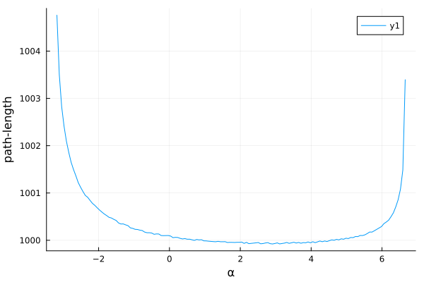

# Tracing auxiliary quantities

```@meta
CurrentModule = Gradus
```

There are many scenarios where it may be useful to trace additional quantities along a geodesic, such as with radiative transfer or polarization. Gradus.jl provides some methods in an attempt to streamline how new quantities and physics may be added.

As an example, let us consider tracing the path-length (a scalar) along the trajectory as we are integrating. Principally, we need only provide a new [`AbstractTrace`](@ref), which is used to dispatch our method, and implement either [`geodesic_ode_problem`](@ref) or [`assemble_tracing_problem`](@ref) function.


```@docs
geodesic_ode_problem
assemble_tracing_problem
```

## Path-length example

The [`AbstractTrace`](@ref) type we define is used to hold on to any quantities we want to be able to set for a given tracing problem. This commonly includes the mass and/or charge of the geodesic, or some initial vector in the case of parallel transport. In our case, we will mandate that all path-lengths start at 0, and therefore only provide the mass `μ` as a field.

```julia
struct TracePathLength{T} <: Gradus.AbstractTrace
    "Geodesic mass"
    μ::T
end
```

The path-length will be calculated as a local toy path-length for simplicity:

```math
\text{d}s^2 = \text{d}r^2 + \text{d}\theta^2 + \text{d}\phi^2,
```

which we can express as a differential equation

```math
\frac{\text{d}s}{\text{d}\lambda} = \sqrt{\left(\frac{\text{d}r}{\text{d}\lambda}\right)^2 + \left(\frac{\text{d}\theta}{\text{d}\lambda}\right)^2 + \left(\frac{\text{d}\phi}{\text{d}\lambda}\right)^2}.
```

Writing this as a Julia function

```julia
function dsdλ(v)
    l2 = (v[2])^2 + (v[3])^2 + (v[4])^2
    sqrt(l2)
end
```

Then we specify how the tracing problem should be put together. This is currently quite a lot of boilerplate code, but gives us plenty of control over how the tracing problems are built should we need it. We first write the function that generates our `ODEProblem`:

```julia
function Gradus.geodesic_ode_problem(
    ::TracePathLength,
    m::AbstractMetric,
    pos,
    vel,
    time_domain,
    callback,
)
    # note this function takes SVector{9} instead of SVector{8}
    function f(u::SVector{9,T}, p, λ) where {T}
        @inbounds let x = SVector{4,T}(u[1:4]), v = SVector{4,T}(u[5:8])
            # geodesic equation as usual
            dv = SVector{4,T}(Gradus.geodesic_equation(m, x, v))

            # calculate our path length difference
            ds = dsdλ(v)

            # concatanate the quantities
            vcat(v, dv, SVector(ds))
        end
    end
    
    # append the initial pathlength
    u_init = vcat(pos, vel, SVector(zero(eltype(pos))))
    
    # this function returns a `OrdinaryDiffEq.ODEProblem` type
    Gradus.ODEProblem{false}(
        f,
        u_init,
        time_domain,
        Gradus.IntegrationParameters(StatusCodes.NoStatus);
        callback = callback,
    )
end
```

We are then ready to trace! For example, using some code from [Getting started](@ref):

```julia
m = KerrMetric(1.0, 0.8)
x = SVector(0.0, 1000.0, deg2rad(90), 0.0)

α = range(-10.0, 10.0, 300)
vs = map_impact_parameters(m, x, α, 0.0)
xs = fill(x, size(vs))
λ_max = 2000.0

sols = tracegeodesics(m, xs, vs, λ_max, trace = TracePathLength(0.0))

# get the path lenght for each geodesic
points = unpack_solution(sols)
lengths = map(p -> p.aux[1], points)

# filter only those that fell into the black hole
I = map(i -> i.status == StatusCodes.WithinInnerBoundary, points)

plot(α[I], lengths[I], xlabel = "α", ylabel = "path-length")
```



