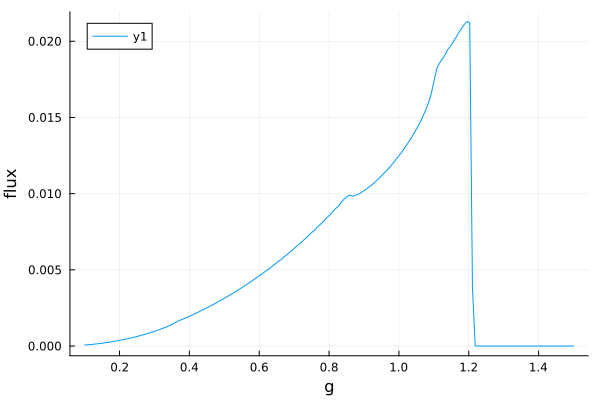
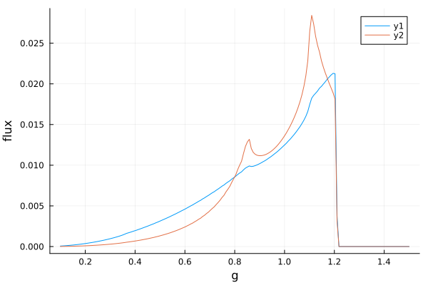
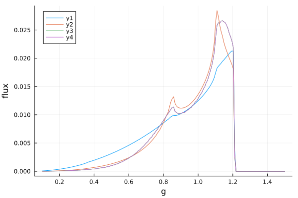
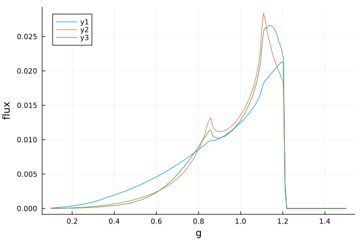
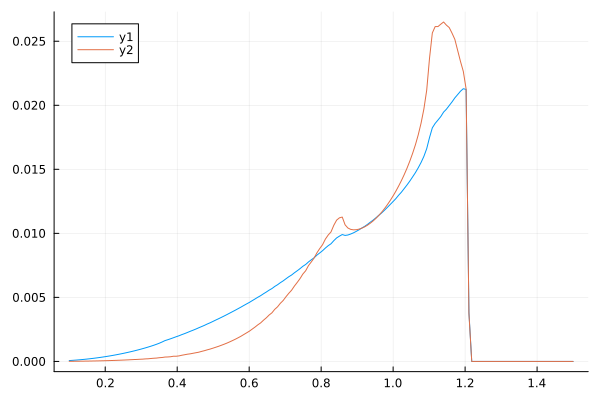

# Line profiles

Line profiles are kernels that represent the blurring of spectral lines from e.g. an accretion disc around a black hole. They show how the flux is smeared over a range of energies relative to the rest energy due to relativistic effects and Doppler shifts.

Gradus.jl has various methods for calculating line profiles (see
[`Methods`](@ref)). Here we will explore how to compute line profiles with
Gradus using the [`BinningMethod`](@ref) and the
[`TransferFunctionMethod`](@ref).

As with any Gradus.jl simulation, we start by picking the basic components of our model:
```julia
using Gradus

m = KerrMetric(M = 1.0, a = 0.998)
# an infinite thin disc in the equatorial plane
d = ThinDisc(0.0, Inf)
x = SVector(0.0, 10_000.0, deg2rad(60), 0.0)
```

We can compute a line profile directly using the [`lineprofile`](@ref) method:

```@docs
lineprofile
```

We can invoke this directly 
```julia
bins, flux = lineprofile(m, x, d)
```

If a custom (enregy) bins is desired, it can be passed using the keyword arguments. We can plot these vectors directly:
```julia
using Plots
plot(bins, flux; xlabel = "g", ylabel = "flux")
```



To pass a custom emissivity function, we can use a different dispatch that takes the `bins` and the emissivity function as the first argument. Here is a shallower power-law, reusing the same bins:
```julia
emissivity(r) = r^-2
bins, flux = lineprofile(bins, emissivity, m, x, d)
plot!(bins, flux)
```



To use the emissivity calcualted via an [`AbstractDiscProfile`](@ref) from a coronal model, we can do something like
```julia
model = LampPostModel(h = 10.0)
profile = emissivity_profile(m, d, model)
bins, flux = lineprofile(m, x, d, profile; bins = bins)
plot!(bins, flux)
```



We can at any point switch to the [`BinningMethod`](@ref) dispatches, which have largely the same functions calls. These methods take significantly longer to execute, and often give slightly lower resolution, however are much more flexible in the underlying assumptions of the model:
```julia
bins, flux = lineprofile(m, x, d, profile; bins = bins, method = BinningMethod())
plot!(bins, flux)
```



The defaults have been chosen to balance accuracy and speed. The above [`TransferFunctionMethod`](@ref) calculations only take a handful of seconds to compute from scratch. If all we are changing are properties of the disc, we do not necessarily need to recompute the transfer functions, and can make use of caches instead. Here is an example recipe using the [`transferfunctions`](@ref) utility:

```julia
tfs = transferfunctions(m, x, d)

f1 = integrate_lineprofile(r -> r^-3, tfs, bins)
f2 = integrate_lineprofile(profile, tfs, bins)

plot(bins, f1)
plot!(bins, f2)
```



Similar pre-computation can be done with the binning method, however there are currently no utility functions available in the same way as with the transfer functions.

```@docs
integrate_lineprofile
```


